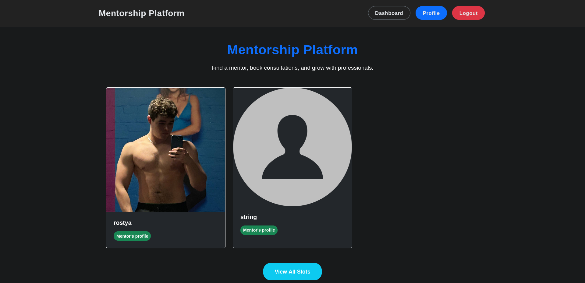
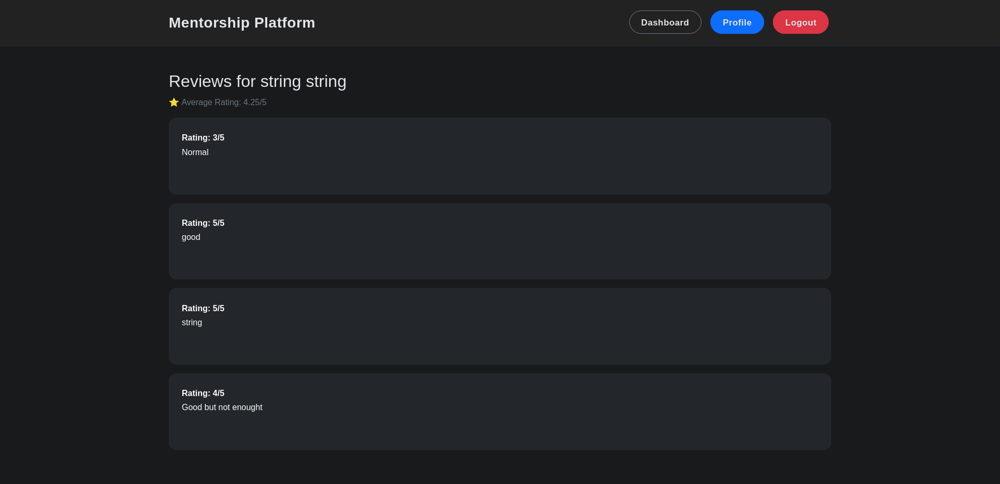
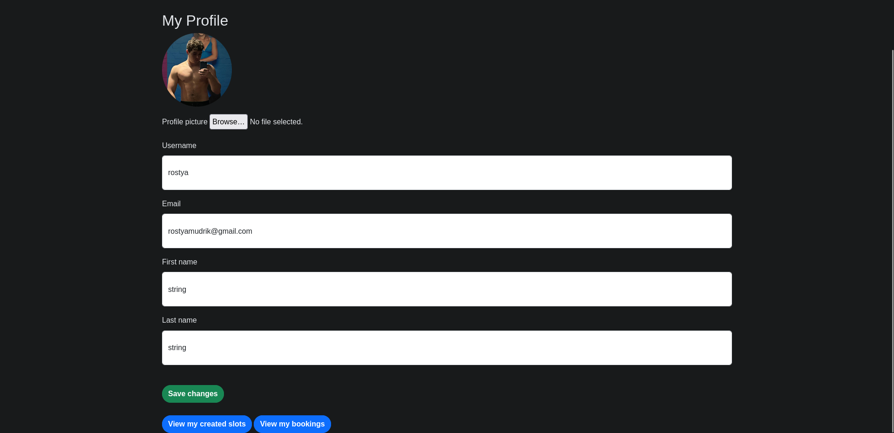
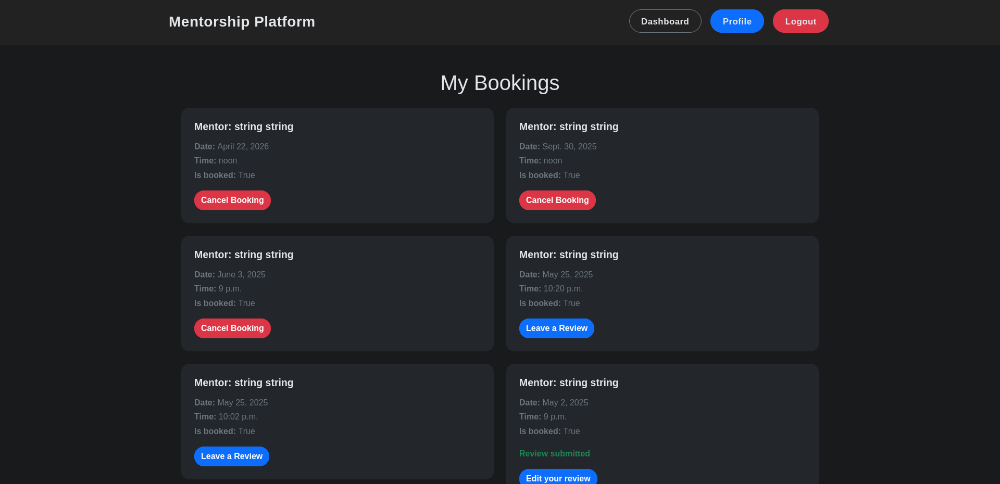
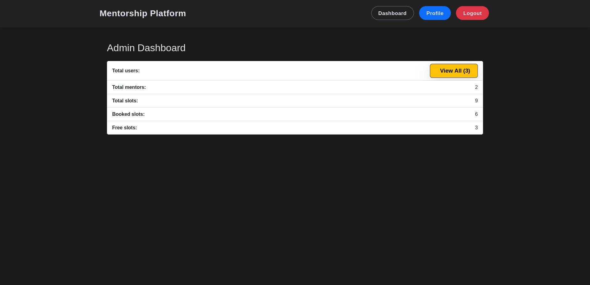
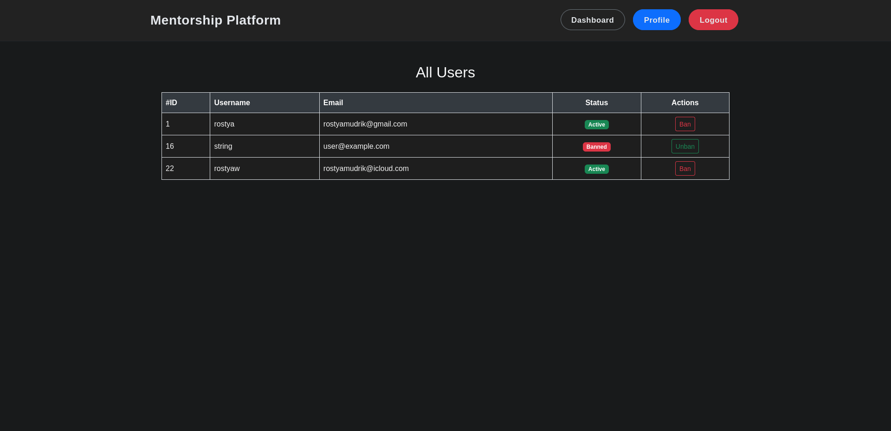
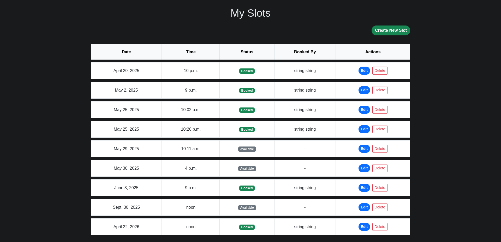

💡 Ідея: Платформа для менторства / консультацій

Сайт, де користувачі можуть записуватись на онлайн-сесії з менторами (наприклад, по програмуванню, фітнесу, інвестиціях).
Основна функціональність:

    1. Головна сторінка

        Презентація сайту

        Список доступних менторів

        Кнопки "Забронювати консультацію", "Зареєструватися"

    2. Аутентифікація

        Реєстрація / логін / логаут

        Роль: користувач або ментор (через is_mentor = models.BooleanField(default=False))

    3. Профіль

        Для менторів: додати опис, фото, графік

        Для користувачів: перегляд своїх бронювань

    4. Розклад

        Ментори створюють слоти (дата, час, доступність)

        Користувачі бачать доступний розклад для кожного ментора

    5. Бронювання

        Користувач вибирає слот і бронює його

        Автоматична зміна статусу слота

        Відображення повідомлень / email-підтвердження

    6. Мої консультації

        Для користувача: список запланованих консультацій

        Для ментора: список клієнтів та обрані слоти

    7. Адмін-панель (dashboard)

        Статистика (скільки користувачів, скільки слотів заброньовано)

        7.1. 
            
            ✅ Загальна мета:

            Зробити окрему сторінку (доступну лише адміну), де буде видно, наприклад:
            
                Загальна кількість користувачів
            
                Кількість менторів
            
                Кількість створених слотів
            
                Кількість заброньованих слотів
            
                Кількість вільних слотів
            

        CRUD для менторів, слотів, бронювань

    8. Додаткове (по бажанню)

        Відгуки після консультації

        Система рейтингу менторів

        Платіжна система (імітація)

mentorship_platform/
├── mentorship_platform/        # Основна конфігурація Django
│   ├── settings.py
│   ├── urls.py
│   └── ...
├── accounts/                   # Авторизація та профілі
│   ├── models.py
│   ├── views.py
│   ├── forms.py
│   ├── urls.py
│   └── templates/accounts/
├── schedule/                   # Слоти та бронювання
│   ├── models.py
│   ├── views.py
│   ├── forms.py
│   ├── urls.py
│   └── templates/schedule/
├── dashboard/                  # Адмін-панель для staff
│   ├── views.py
│   ├── urls.py
│   └── templates/dashboard/
├── static/
├── templates/
│   └── base.html
└── manage.py
+ main app

└──

WebSocket

    Это двунаправленное (bidirectional) соединение.

    Постоянное соединение между клиентом и сервером.

    Оба могут отправлять данные в любой момент, не дожидаясь запроса.

    Используется для реального времени: чат, нотификации, онлайн-игры, обновления данных без перезагрузки.

to learn:

2. Веб-сокеты и real-time (Django Channels)

    Что сделать:
        Реализовать чат между ментором и учеником.
        Показывать статус (онлайн/оффлайн) пользователей.
    Что изучишь: Реактивные интерфейсы, Channels, WebSocket-протокол.

3. Интеграция с внешними сервисами (OAuth, Google Calendar API)

    Что сделать:
        Добавить авторизацию через Google/GitHub.
        Синхронизировать встречи с Google Calendar.
    Что изучишь: OAuth 2.0, работу с внешними API, requests и social-auth.

4. GraphQL (Django + Graphene)

    Что сделать:
        Добавить GraphQL-эндпоинты вместо/параллельно REST.
    Что изучишь: Основы GraphQL, сравнение с REST, построение схем.

7. Контейнеризация и деплой (Docker, CI/CD, GitHub Actions)

    Что сделать:
        Собрать docker-compose для dev/prod.
        Настроить автоматический деплой на сервер (например, через GitHub Actions).
    Что изучишь: Docker, пайплайны CI/CD, деплой на VPS или облако.

8. Админка и кастомная панель (Django Admin, Grappelli, Django Jet)

    Что сделать:
        Прокачать админку: добавить фильтры, отчёты, кастомные действия, графики.
    Что изучишь: Кастомизация Django Admin, работа с JS в админке.

9. Фронтенд: React/Vue + интеграция с DRF

   Что сделать:
       Сделать SPA-часть или полностью фронт на React/Vue, интегрировать с DRF.
   Что изучишь: Современный фронтенд, API-интеграцию, CORS.

10. Мониторинг и логирование (Sentry, Prometheus, Grafana)

    Что сделать:
        Включить сбор ошибок и алёртов.
    Что изучишь: DevOps-инструменты, мониторинг, алёрты.

11. Продвинутая авторизация (JWT refresh, RBAC, ACL)

    Что сделать:
        Роли и права, выдача токенов с обновлением, временные доступы.
    Что изучишь: Безопасность, управление ролями и правами.

12. Мобильное приложение (React Native, Flutter)

    Что сделать:
        Мини-приложение для учеников/менторов, дата-пикеры, пуши.
    Что изучишь: Мобильный dev, интеграция с backend.

Middlewares:

    Вот список нестандартных и редких идей для Django middleware, которые ты вряд ли найдёшь в типичных подборках:

    1. Генерация и проверка цифрового “отпечатка” запроса
    Сохраняет хеш (например, по IP, user-agent, cookies) в сессионных данных, чтобы обнаруживать подмену пользователя или сессии.

    2. Запрет повторных POST-запросов (антидубль)
    Middleware, который предотвращает повторную отправку формы (например, через кнопку “Обновить”) на уровне сервера (анти-double submit).

    4. Мгновенная блокировка при попытке SQL-инъекции
    Проверяет query string и body на подозрительные паттерны (например, ' OR 1=1 --) и мгновенно банит/логирует IP.

    6. Динамический выбор шаблона по празднику/дате
    Автоматически подменяет шаблон для определённых дат (например, 1 января — “Новогодний” шаблон).

    7. Кэширование на лету только для анонимных пользователей
    Middleware, который кеширует только ответы для неавторизованных юзеров, не трогая остальных.

    8. Детектирование TOR/VPN (по IP-адресу)
    Проверяет IP по базе TOR/VPN exit nodes и записывает флаг в request, чтобы потом учитывать в логике приложения.

    9. Вставка баннера о новых обновлениях
    Добавляет к каждому HTML-ответу баннер “У нас новая версия сайта!” — только для пользователей, которые не видели новый билд (по cookie/etag).

    10. Массовое логирование подозрительной активности
    Собирает статистику по типам подозрительных действий (например, частые 400/403/404) и сгруппировано отправляет админам раз в N минут.

    11. Динамическое ограничение скорости на основе времени суток
    В ночное время разрешает больше запросов, а днём — меньше (или наоборот), динамически регулируя rate limit.

    12. Временное отключение сайта по “секретной” ссылке
    Middleware, который может “выключить” сайт для всех, кроме тех, кто перешёл по секретному URL и получил временный токен.

    13. Вставка кастомных CSP-headers на лету
    Гибко меняет Content-Security-Policy в зависимости от URL, user-agent или других условий.

    14. Маскировка оригинальных ошибок (security through obscurity)
    Middleware, которое для подозрительных запросов возвращает не настоящие ошибки (например, 404 вместо 403 или 500), чтобы затруднить автоматизированный взлом.
