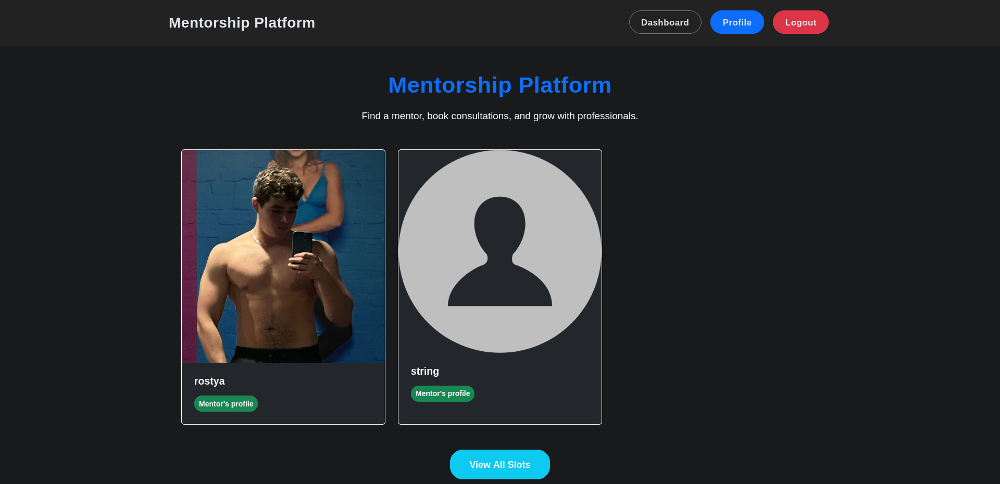
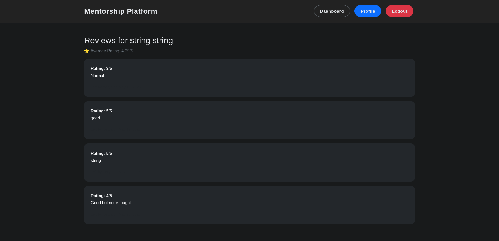
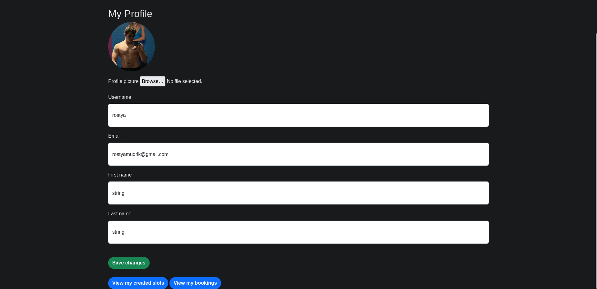
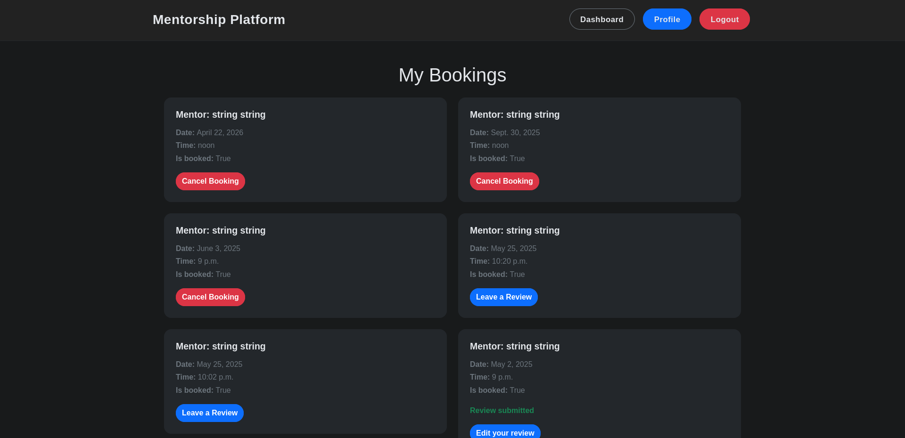
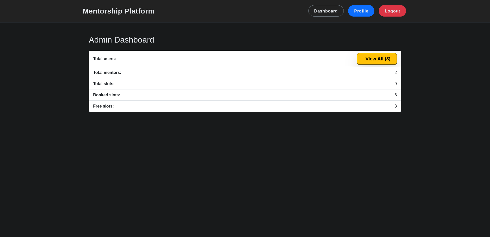
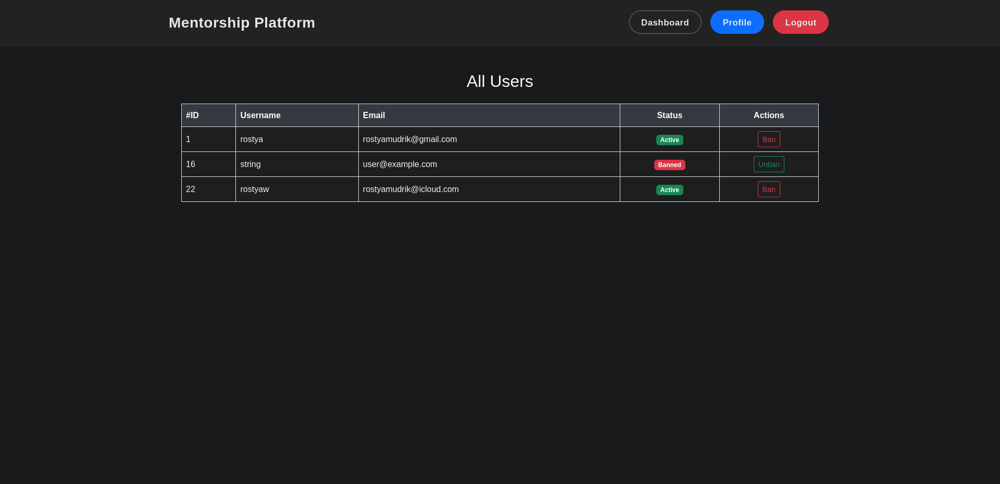
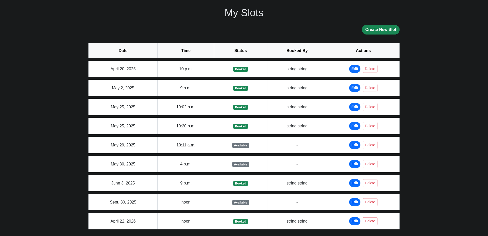
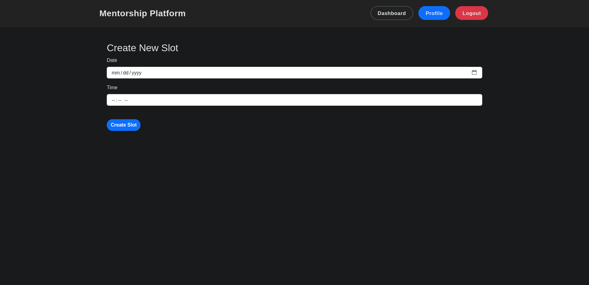
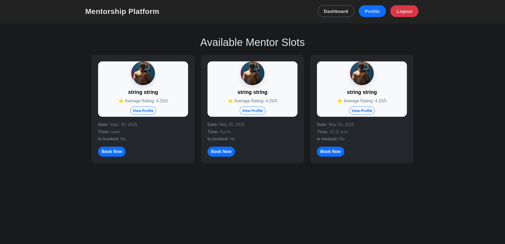

💡 Ідея: Платформа для менторства / консультацій

Сайт, де користувачі можуть записуватись на онлайн-сесії з менторами (наприклад, по програмуванню, фітнесу, інвестиціях).
Основна функціональність:

    1. Головна сторінка

        Презентація сайту

        Список доступних менторів

        Кнопки "Забронювати консультацію", "Зареєструватися"

    2. Аутентифікація

        Реєстрація / логін / логаут

        Роль: користувач або ментор (через is_mentor = models.BooleanField(default=False))

    3. Профіль

        Для менторів: додати опис, фото, графік

        Для користувачів: перегляд своїх бронювань

    4. Розклад

        Ментори створюють слоти (дата, час, доступність)

        Користувачі бачать доступний розклад для кожного ментора

    5. Бронювання

        Користувач вибирає слот і бронює його

        Автоматична зміна статусу слота

        Відображення повідомлень / email-підтвердження

    6. Мої консультації

        Для користувача: список запланованих консультацій

        Для ментора: список клієнтів та обрані слоти

    7. Адмін-панель (dashboard)

        Статистика (скільки користувачів, скільки слотів заброньовано)

        7.1. 
            
            ✅ Загальна мета:

            Зробити окрему сторінку (доступну лише адміну), де буде видно, наприклад:
            
                Загальна кількість користувачів
            
                Кількість менторів
            
                Кількість створених слотів
            
                Кількість заброньованих слотів
            
                Кількість вільних слотів
            

        CRUD для менторів, слотів, бронювань

    8. Додаткове (по бажанню)

        Відгуки після консультації

        Система рейтингу менторів

        Платіжна система (імітація)

mentorship_platform/
├── mentorship_platform/        # Основна конфігурація Django
│   ├── settings.py
│   ├── urls.py
│   └── ...
├── accounts/                   # Авторизація та профілі
│   ├── models.py
│   ├── views.py
│   ├── forms.py
│   ├── urls.py
│   └── templates/accounts/
├── schedule/                   # Слоти та бронювання
│   ├── models.py
│   ├── views.py
│   ├── forms.py
│   ├── urls.py
│   └── templates/schedule/
├── dashboard/                  # Адмін-панель для staff
│   ├── views.py
│   ├── urls.py
│   └── templates/dashboard/
├── static/
├── templates/
│   └── base.html
└── manage.py
+ main app

└──

WebSocket

    Это двунаправленное (bidirectional) соединение.

    Постоянное соединение между клиентом и сервером.

    Оба могут отправлять данные в любой момент, не дожидаясь запроса.

    Используется для реального времени: чат, нотификации, онлайн-игры, обновления данных без перезагрузки.

to learn:

2. Веб-сокеты и real-time (Django Channels)

    Что сделать:
        Реализовать чат между ментором и учеником.
        Показывать статус (онлайн/оффлайн) пользователей.
    Что изучишь: Реактивные интерфейсы, Channels, WebSocket-протокол.

3. Интеграция с внешними сервисами (OAuth, Google Calendar API)

    Что сделать:
        Добавить авторизацию через Google/GitHub.
        Синхронизировать встречи с Google Calendar.
    Что изучишь: OAuth 2.0, работу с внешними API, requests и social-auth.

4. GraphQL (Django + Graphene)

    Что сделать:
        Добавить GraphQL-эндпоинты вместо/параллельно REST.
    Что изучишь: Основы GraphQL, сравнение с REST, построение схем.

7. Контейнеризация и деплой (Docker, CI/CD, GitHub Actions)

    Что сделать:
        Собрать docker-compose для dev/prod.
        Настроить автоматический деплой на сервер (например, через GitHub Actions).
    Что изучишь: Docker, пайплайны CI/CD, деплой на VPS или облако.

8. Админка и кастомная панель (Django Admin, Grappelli, Django Jet)

    Что сделать:
        Прокачать админку: добавить фильтры, отчёты, кастомные действия, графики.
    Что изучишь: Кастомизация Django Admin, работа с JS в админке.

9. Фронтенд: React/Vue + интеграция с DRF

   Что сделать:
       Сделать SPA-часть или полностью фронт на React/Vue, интегрировать с DRF.
   Что изучишь: Современный фронтенд, API-интеграцию, CORS.

10. Мониторинг и логирование (Sentry, Prometheus, Grafana)

    Что сделать:
        Включить сбор ошибок и алёртов.
    Что изучишь: DevOps-инструменты, мониторинг, алёрты.

11. Продвинутая авторизация (JWT refresh, RBAC, ACL)

    Что сделать:
        Роли и права, выдача токенов с обновлением, временные доступы.
    Что изучишь: Безопасность, управление ролями и правами.

12. Мобильное приложение (React Native, Flutter)

    Что сделать:
        Мини-приложение для учеников/менторов, дата-пикеры, пуши.
    Что изучишь: Мобильный dev, интеграция с backend.